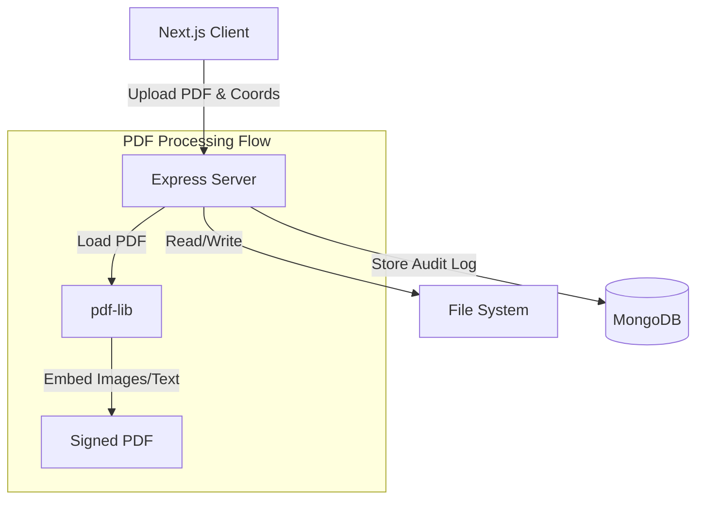

# Signature Injection Engine

A full-stack prototype for injecting signatures and other elements into PDF documents. This application allows users to upload a PDF, drag and drop fields (Signature, Text, Date, Checkbox) onto specific pages, and "burn in" these elements to create a permanently modified PDF. It also maintains a secure audit trail of all signed documents.

## Features

-   **PDF Rendering**: High-fidelity PDF rendering in the browser using `react-pdf`.
-   **Drag and Drop Interface**: Intuitive UI to drag fields (Signature, Text Box, Date, Checkbox) onto the document.
-   **Multi-Page Support**: signature placement on any page of the PDF.
-   **Interactive Elements**:
    -   **Resizing**: Resize fields using a drag handle.
    -   **Text Input**: Type directly into text fields before signing.
    -   **Date/Checkbox**: fully functional input fields.
-   **Backend Signing**: Secure server-side processing using `pdf-lib` to modify the actual PDF binary.
-   **Audit Trail**: hashes of the original and signed documents are stored in MongoDB to ensure integrity.
-   **Dockerized**: Full containerization support for easy deployment.

## Tech Stack

### Frontend (`client`)
-   **Framework**: Next.js 15 (React 19)
-   **Styling**: Tailwind CSS
-   **PDF Handling**: `react-pdf`
-   **Drag & Drop**: `react-dnd`

### Backend (`server`)
-   **Runtime**: Node.js & Express
-   **Language**: TypeScript
-   **PDF Processing**: `pdf-lib`
-   **Database**: MongoDB (via `mongoose`)
-   **File Storage**: Local filesystem (uploads directory)

## Architecture



## Setup & Installation

### Prerequisites
-   Node.js (v18+)
-   MongoDB (Running locally or URL)
-   Docker & Docker Compose (optional)

### Option 1: Docker (Recommended)

Run the entire stack with a single command:

```bash
docker-compose up --build
```

-   **Client**: http://localhost:3000
-   **Server**: http://localhost:8000
-   **MongoDB**: Using port 27017

### Option 2: Local Development

#### 1. Server Setup
```bash
cd server
npm install
npm run dev
```
Create a `.env` file in `server/`:
```
PORT=8000
MONGODB_URI=mongodb://localhost:27017/pdf-signature
```

#### 2. Client Setup
```bash
cd client
npm install
npm run dev
```
The client will be available at `http://localhost:3000`.

## Usage

1.  Open the application at `http://localhost:3000`.
2.  Click "Choose File" to upload a PDF document.
3.  Use the sidebar to drag fields onto the PDF page.
4.  **Edit Fields**:
    -   Click to select a field.
    -   Drag the handle (bottom-right) to resize.
    -   Type into text boxes.
    -   Click the red trash icon to remove.
5.  **Navigate**: Use the "Prev/Next" arrows at the top to switch pages. Fields are page-specific.
6.  Click **"Burn In Signature"** (floating button).
7.  Wait for processing. The "View Signed PDF" button will appear in the header.
8.  Click it to download/view the final document.
